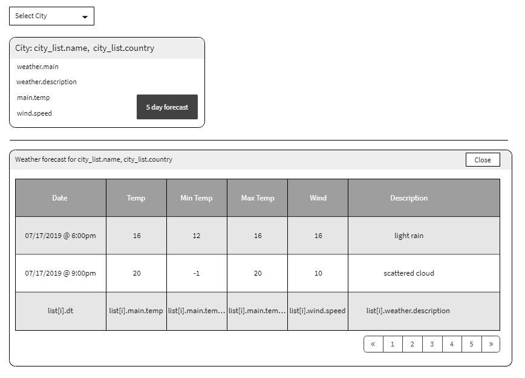

Build a simple react/redux weather application. The application should show current weather of selected city and have functionality to provide a 5 day forecast for the selected city. Below is a wireframe for the screen.

 ## Requirements 

+ Use whatever libraries you want
+ Have proper component breakdown
+ Have app working via redux store
+ Look & feel very flexible. It doesn't have to look the way it is shown in picture below but should look presentable.
+ API call documentation can be found [here](https://openweathermap.org/api)
+ Bonus points for making app pagable

### Wireframe

### Step 1

Get list of cities for dropdown.
Load from public/cities.json

### Step 2

On dropdown change get selected city and for that cityt load weather and show panel with weather details.

Load from: http://api.openweathermap.org/data/2.5/weather?id=[city id from Step #1]&appid=a30f79a44d74a7b2c4c8f414d958a23e
ex: [http://api.openweathermap.org/data/2.5/weather?id=524901&appid=a30f79a44d74a7b2c4c8f414d958a23e](http://api.openweathermap.org/data/2.5/weather?id=524901&appid=a30f79a44d74a7b2c4c8f414d958a23e) 

### Step 3

On click on 5 day forecast button get forecast and render table.

Load from: http://api.openweathermap.org/data/2.5/forecast?id=[city id from Step #1]&appid=a30f79a44d74a7b2c4c8f414d958a23e
ex: [http://api.openweathermap.org/data/2.5/forecast?id=524901&appid=a30f79a44d74a7b2c4c8f414d958a23e](http://api.openweathermap.org/data/2.5/forecast?id=524901&appid=a30f79a44d74a7b2c4c8f414d958a23e)

### Step 4

Add close button to forecast panel that works.

